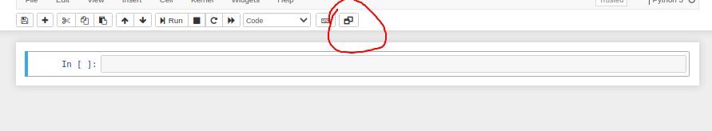
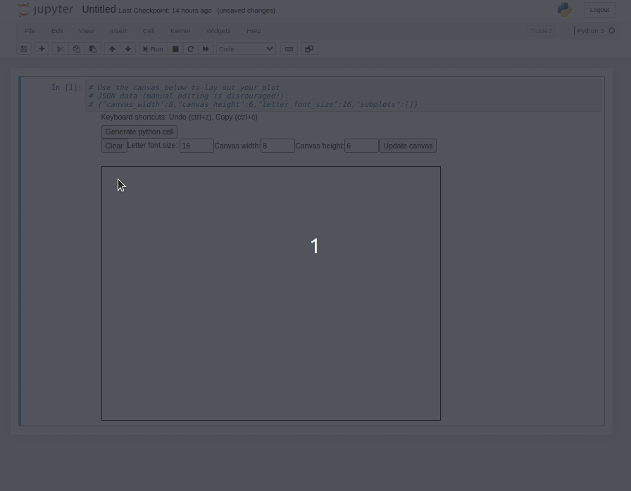
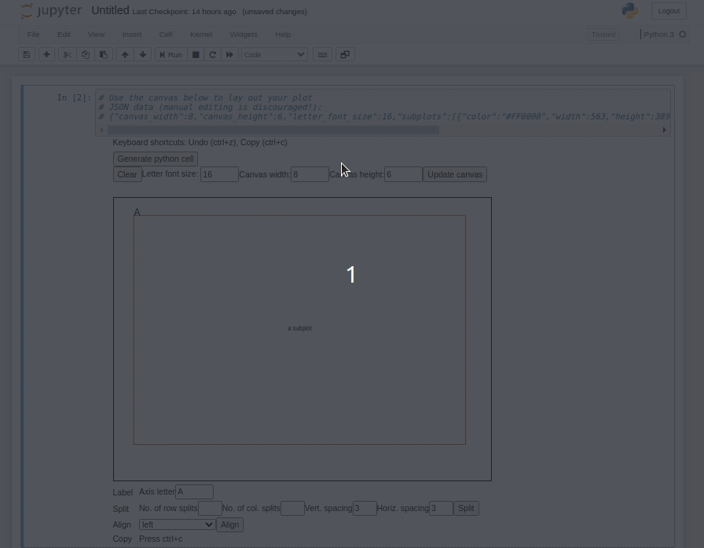
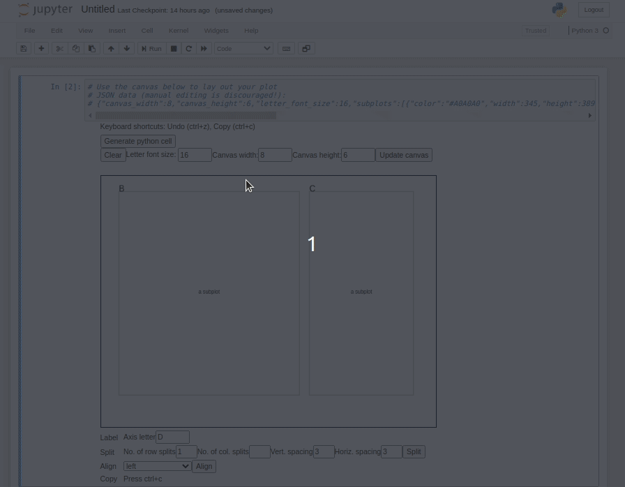
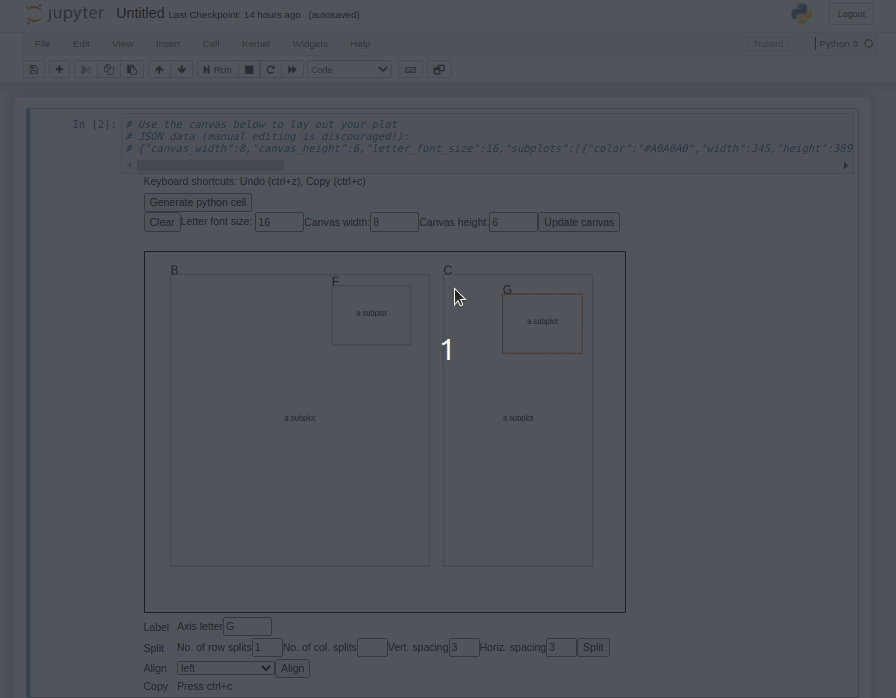
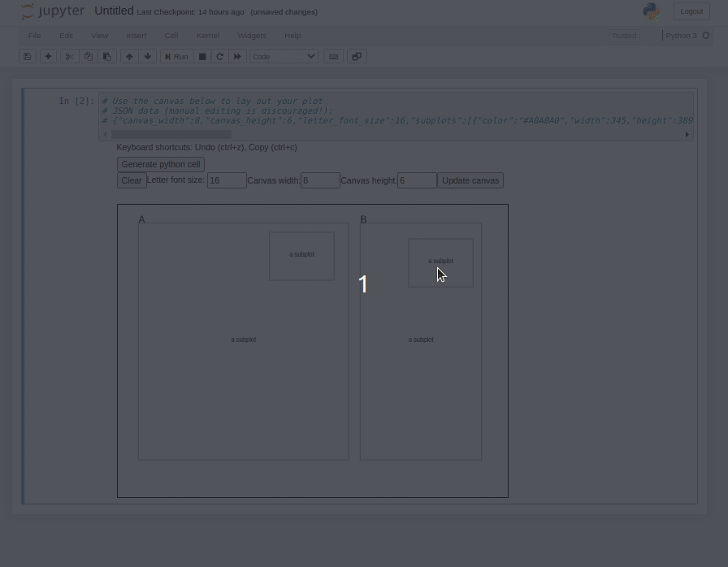
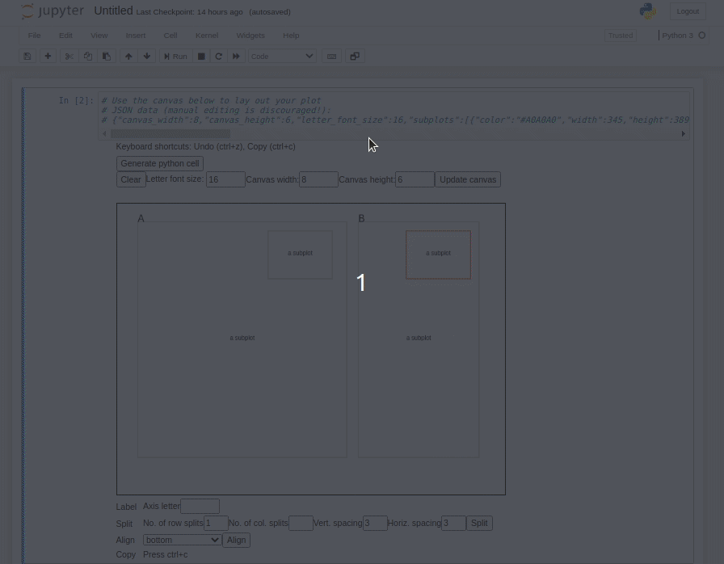
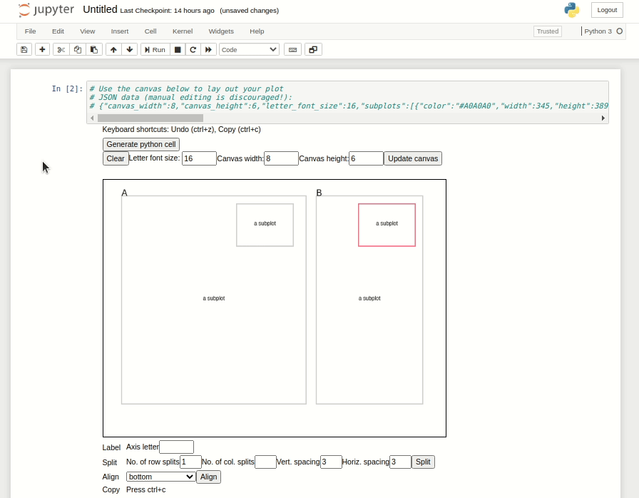

# figure-layout

This extension may be useful to matplotlib users who want to create intricate plot layouts, such as for scientific publications, which would normally be more convenient in a non-python graphical tool such as Inkscape or Photoshop. 

## Usage
Begin with an empty notebook cell and press the icon on the far right which looks like two desktop windows. 

You can use your mouse to create an initial subplot:

If you click on a subplot, you "select" it, as indicated by the border in red. When a subplot is selected, some sublot-specific actions become available as listed below the canvas. In this simple demo, we'll split our first subplot into two components and resize them by dragging edges:

Now we can create some inset plots. If you select a subplot, you can
- press 'd' to delete it
- use the arrow keys to move it
- press ctrl + c to make a copy, then click where to paste

We can adjust the automatically-assigned labels to whatever we like (removing them entirely from the insets)

Lastly, the alignment tool can be used to ensure that two subplots share the same reference point (left edge position, right edge position, etc.)

When you're satisfied with your layout, press the "Generate python cell" button to create a cell with equivalent python/matplotlib code. 

If you reload the page, the canvas will disappear. However, the widget automatically saves your place in the cell holding the canvas. This lets you pick up where you left off if you want to make any changes:

